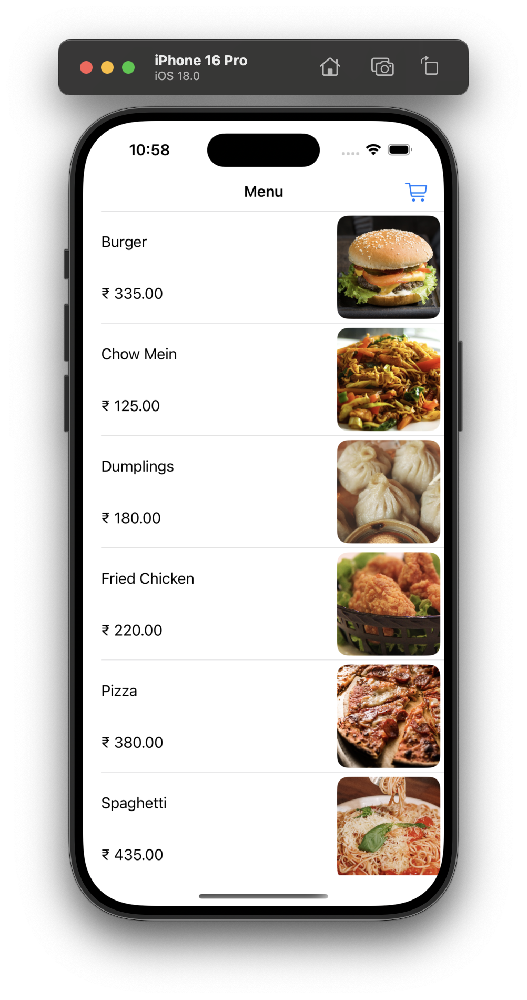
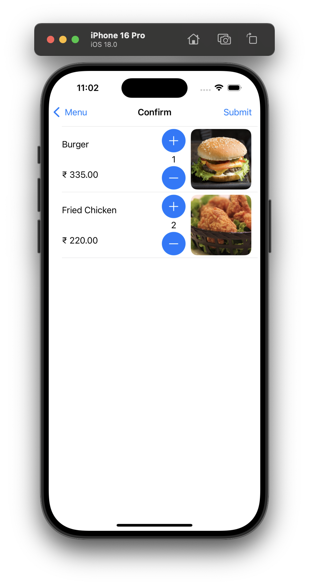
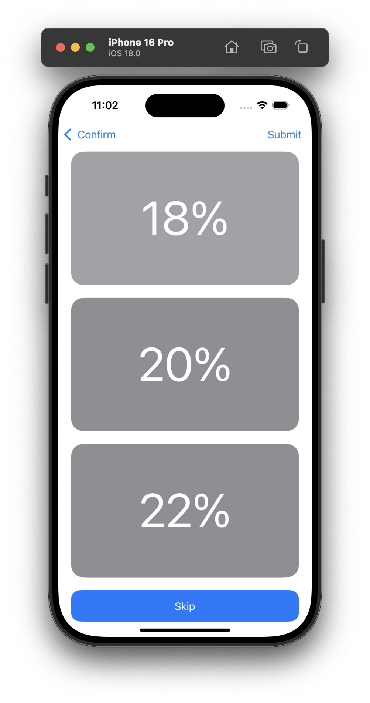
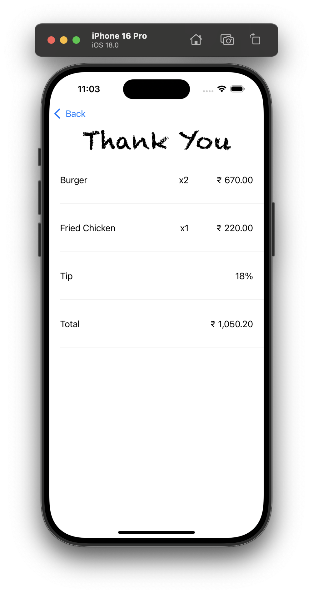

# YallBeTipping

This app contains 4 `UIViewController`s embedded inside a `NavigationController`:

1. **Home View Controller:**
    * This is the app's main entry point.
    * Elements used are `UITableView`, `UITableViewCell`, `UILabel` and `UIButton`.
    * 
2. **Confirm View Controller:**
    * This is the second UI Controller in the app.
    * Elements used are `UITableView`, `UITableViewCell`, `UILabel` and `UIButton`
    * 
3. **Tip View Controller:**
    * This is the third UI Controller in the app.
    * This `UIControllerView` consists only `UIButton`
    * 
4. **Receipt View Controller:**
    * This is the last UI Controller in the app
    * Elements used are `UITableView`, `UITableViewCell` and `UILabel`
    * 
